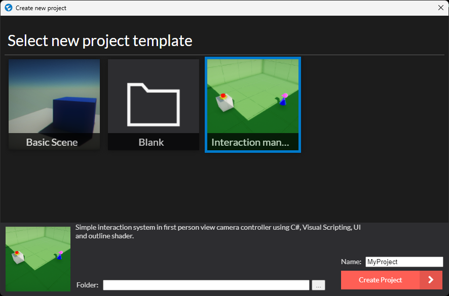
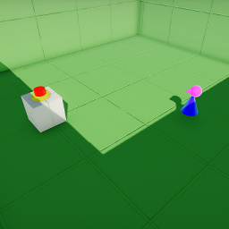

# Interaction system template package 

Howto : add a new template to the Flax launcher.



meta.xml :

```<Meta>
	<Name>Interaction manager</Name>
	<Type>ProjectTemplate</Type>
	<Author>Alewinn</Author>
	<Description>Simple interaction system in first person view camera controller using C#, Visual Scripting, UI and outline shader.</Description>
</Meta>```

- [<= root](../) 