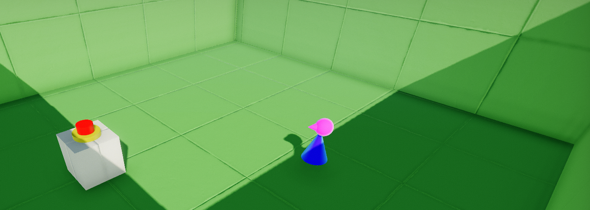
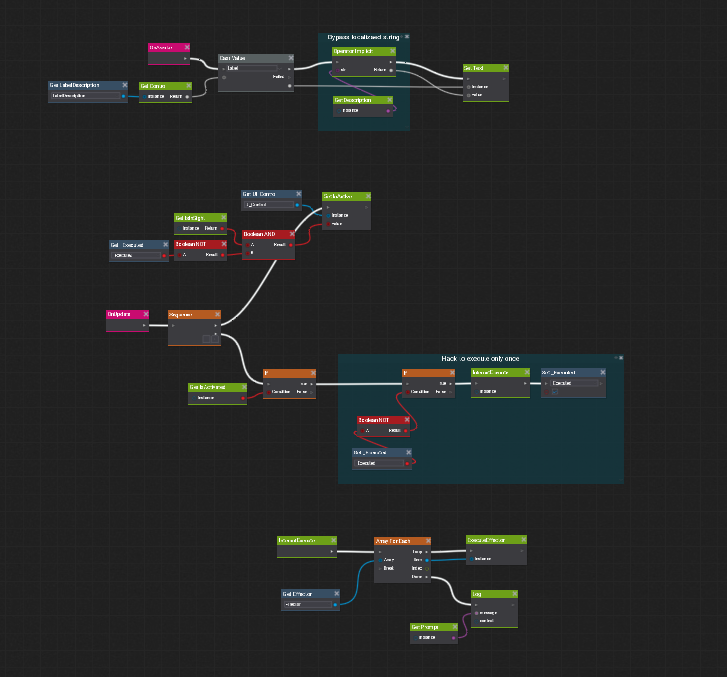
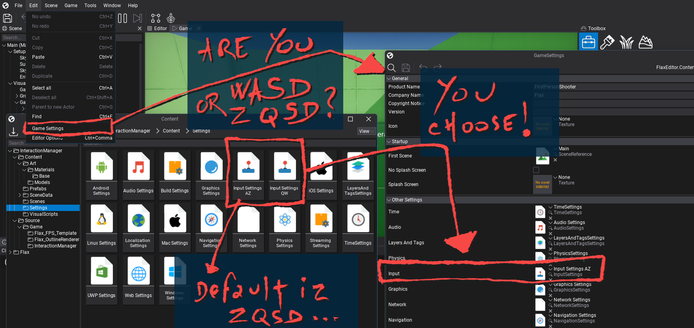

# Flax Visual Scripting Showcase

Simple interaction system with first person view controller using C#, Visual Scripting, UI and outline shader. 

This project is not a complete framework but a minimal demonstration intended to show how to combine C#, Visual Scripting, UI and custom rendering in Flax.

---
Demonstrated Features :
- Player Interaction
- Interactive System
- Button-Controlled Door
- Visual Scripting
- Screen UI
- World-Space UI
- Camera Scripting for Outline Effect (PostFX)

---
Installation
Mandatory: 

- Install Flax 1.12 (see https://flaxengine.com/download/ for download)

From repository :
- Download the current repository
- Open "Flax Visual ScriptingShowcase/InteractionManager.flaxproj"
- Load the main scene
- Press Play

OR with flaxpackage :
- Use the Interaction Manager flaxpackage template file inside the launcher (see [Howto : create and add a new template to the Flax launcher.](/Launcher/) )

Setup :

Other links in this repository ;

- [Howto : create and add a new template to the Flax launcher.](/Launcher/)
- [Some Visual Nodes experience feedbacks](/Docs/)

---

This project is intended as a community sample for Flax Engine.
It contains original work as well as content derived from Flax Engine templates and examples.
Flax Engine and any content originating from Flax remain subject to their respective licenses.
Refer to the Flax Engine license for additional information.
